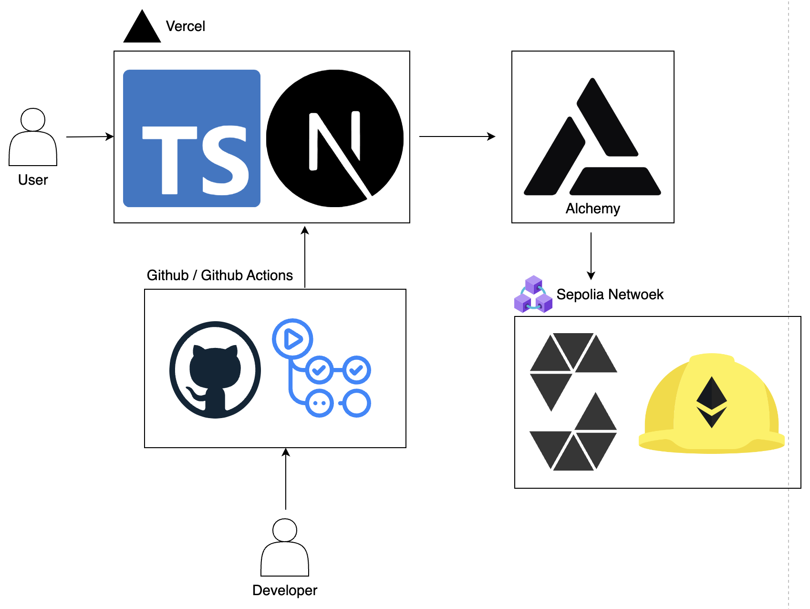

# Blockchain based Bank App

## Agenda

1. [Technology](#Technology)
2. [Environment](#Environment)
3. [Deploy](#Deploy)

<!-- プロジェクトについて -->

## About the Project

Blockchain based Bank App

<!-- プロジェクトの概要を記載 -->

Only NFT holders can use the money transfer, deposit, and withdrawal functions. 
Non-NFT holders can receive money but cannot perform other transactions.

## Technology

<!-- 言語、フレームワーク、ミドルウェア、インフラの一覧とバージョンを記載 -->

### Frontend

| Languages, frameworks and libraries | version |
| ----------------------------------- | ------- |
| Node.js                             | 21.1.0  |
| TypeScript                          | 5.2.2   |
| React                               | 18      |
| Next.js                             | 14.0.4  |
| ethers                              | 5.6.9   |

### Backend

| Languages, frameworks | version |
| --------------------- | ------- |
| Solidity              | 0.8.9   |
| hardhat               | 2.9.9   |

### Infrastructure

| Technology      | version |
| --------------- | ------- |
| Vercel          |         |
| Sepolia Network |         |

### CI / CD

| Technology     | version |
| -------------- | ------- |
| Github Actions | CI      |
| Vercel         | CD      |

## System Architecture

## Deploy

https://nft2-d3r7smpuy-ajipon-44s-projects.vercel.app/
